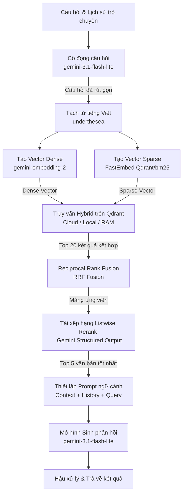

<p align="center">
  
</p>

<p align="center">
  <a href="https://github.com/VictorNguyenLPN/Legal-RAG/stargazers">
    
  </a>
  <a href="https://github.com/VictorNguyenLPN/Legal-RAG/network/members">
    
  </a>
  <a href="https://github.com/VictorNguyenLPN/Legal-RAG/issues">
    
  </a>
</p>

<p align="center">
  <strong>Hệ thống Hỏi Đáp Văn Bản Pháp Luật (RAG) sử dụng Hybrid Search & Gemini</strong>
</p>

<p align="center">
  <a href="README_EN.md">English 🌐</a> | <a href="README.md">Tiếng Việt 🇻🇳</a> | <a href="README_ZH.md">简体中文 🇨🇳</a>
</p>

---

>[!NOTE] Phiên bản hiện tại: v2.6.0 (14/08/2026)

Hệ thống Hỏi Đáp Văn Bản Pháp Luật (Legal RAG) được xây dựng hoàn toàn bằng Python, tích hợp tìm kiếm kết hợp Hybrid Search (Dense & Sparse) trên nền tảng **Qdrant**, sử dụng bộ tách từ tiếng Việt **underthesea**, kết hợp **Listwise Reranking** bằng Gemini và sinh câu trả lời bằng Google Gemini.

## Tính năng nổi bật

- **Hybrid Search (Tìm kiếm kết hợp):**
  - **Dense search:** Biểu diễn ngữ nghĩa bằng `gemini-embedding-2` + `cosine similarity`.
  - **Sparse search:** Tìm kiếm từ khóa hiệu năng cao trên Qdrant sử dụng mô hình sparse `FastEmbed` (`Qdrant/bm25`).

- **Xử lý tiếng Việt (Vietnamese NLP):** Tích hợp công cụ tách từ chuyên sâu `underthesea` trước khi lập chỉ mục sparse search, nâng cao độ chính xác khi tìm kiếm luật tiếng Việt.

- **Listwise Reranking bằng LLM:** Sử dụng Gemini API với cấu trúc JSON output (`response_schema`) để tái xếp hạng danh sách tài liệu ứng viên từ RRF Fusion, giữ lại top 5 tài liệu liên quan nhất để đưa vào ngữ cảnh.

- **Cơ sở dữ liệu Vector Cloud-native:** Chuyển đổi sang **Qdrant** hỗ trợ 3 chế độ chạy linh hoạt:
  - **Qdrant Cloud:** Lưu trữ dữ liệu vĩnh viễn trên đám mây (khuyên dùng cho Production).
  - **Qdrant Local Persistent:** Lưu trữ cục bộ tại thư mục `data/db/qdrant` giúp tránh re-embedding tốn chi phí API khi khởi chạy lại server local.
  - **Qdrant In-Memory:** Lưu trữ tạm thời trên RAM (khi bật `QDRANT_USE_MEMORY=true`).

- **LLM**: Sử dụng `gemini-3.1-flash-lite` cho các tác vụ sinh phản hồi và cô đọng câu hỏi.

- **Quản lý & Lưu trữ Lịch sử Hội thoại:** Hỗ trợ lưu trữ persistent lịch sử chat nhiều phiên làm việc dưới LocalStorage, cho phép người dùng tạo mới, chuyển đổi qua lại giữa các cuộc hội thoại cũ, đổi tên trực tiếp trên sidebar, và xóa từng hội thoại (có xác nhận bảo vệ) hoặc xóa sạch toàn bộ.

- **Giao diện Trực quan:** `React` + `Vite` + `TypeScript`.

---

## Giao diện

### Giao diện chính khi chưa có dữ liệu


### Giao diện khi có câu hỏi


### Giao diện câu trả lời và trích dẫn


## Kiến trúc Hệ thống (System Architecture)




## Cấu trúc Thư mục

```text
Law-RAG/
├── backend/
│   └── app/
│       ├── api/
│       │   └── routes.py         # Định nghĩa API
│       ├── services/
│       │   ├── gemini_service.py # Gọi API Gemini (Embedding, Generation, Reranking)
│       │   └── rag_service.py    # Điều phối luồng RAG pipeline
│       ├── retrieval/
│       │   ├── dense.py          # Tìm kiếm Dense trực tiếp trên Qdrant
│       │   ├── sparse.py         # Tìm kiếm Sparse trực tiếp trên Qdrant
│       │   └── fusion.py         # Thuật toán Reciprocal Rank Fusion (RRF)
│       ├── database/
│       │   └── vector_db.py      # Quản lý kết nối và thao tác với Qdrant (Cloud/Local)
│       ├── models/
│       │   └── schema.py         # Pydantic models xác thực dữ liệu API
│       ├── config.py             # Cấu hình biến môi trường & Siêu tham số
│       └── main.py               # Khởi chạy FastAPI App
├── frontend/
│   └── app.tsx                   # Giao diện React
│   └── ...                       # Các component khác
├── data/
│   ├── input/                    # Thư mục chứa dữ liệu JSON đầu vào
│   └── db/
│       └── qdrant/               # Lưu trữ CSDL Qdrant cục bộ (Persistent fallback)
├── requirements.txt              # Thư viện phụ thuộc
└── README.md                     # Hướng dẫn sử dụng
```

---

## Hướng dẫn Cài đặt & Chạy Chương trình

### 1. Chuẩn bị Môi trường

Yêu cầu máy cài sẵn **Python 3.10+**. Khởi tạo virtual environment và cài đặt các thư viện:

```bash
# Tạo môi trường ảo
python3 -m venv .venv

# Kích hoạt môi trường ảo
source .venv/bin/activate

# Cài đặt thư viện phụ thuộc
pip install -r requirements.txt
```

### 2. Thiết lập API Key

Hệ thống yêu cầu API Key của Google Gemini. Cung cấp API Key thông qua biến môi trường:

```bash
export GEMINI_API_KEY="AIzaSyYourGeminiApiKeyHere..."
```

Hoặc, tạo file `.env` tại thư mục gốc của dự án và ghi `GEMINI_API_KEY=AIzaSy...`

### 3. Khởi chạy Backend

```bash
PYTHONPATH=. .venv/bin/uvicorn backend.app.main:app --host 0.0.0.0 --port 8000 --reload
```
> API docs (Swagger UI) sẽ khả dụng tại: http://localhost:8000/docs

### 4. Khởi chạy Frontend

```bash
cd frontend && npm run dev
```
> Giao diện Web UI sẽ tự động mở tại: http://localhost:5173/

### 5. Cấu trúc Dữ liệu Đầu vào & Nạp tài liệu (Ingestion)

Để nạp tài liệu pháp luật của riêng bạn vào hệ thống, hãy chuẩn bị một tệp tin định dạng `.json` chứa danh sách các phân mảnh (chunks).

#### Định dạng JSON Schema của dữ liệu đầu vào:

Tệp tin JSON phải là một mảng các đối tượng (array of objects), mỗi đối tượng đại diện cho một phân mảnh văn bản pháp lý với cấu trúc mẫu như sau:

```json
[
  {
    "chunk_id": "law_7eef1c6f9712c9a77af24be877851ca1_a1",
    "node_type": "article",
    "metadata": {
      "document_id": "7eef1c6f9712c9a77af24be877851ca1",
      "document_type": "Bộ luật",
      "document_title": "Bộ luật Hình sự số 15/1999/QH10",
      "doc_identity": "15/1999/QH10",
      "major_names": [
        "Tư pháp"
      ],
      "field_names": [
        "Chưa phân loại"
      ],
      "issue_date": "1999-12-21",
      "effect_date": "2000-07-01",
      "effect_status_name": "Hết hiệu lực toàn bộ",
      "expire_date": "2018-01-01",
      "organ_names": [
        "Quốc hội"
      ],
      "signer_title_names": [
        "Chủ tịch Quốc hội"
      ],
      "signer_names": [
        "Nông Đức Mạnh"
      ],
      "vbpl_url": "https://vbpl.vn/van-ban/chi-tiet/bo-luat-hinh-su-so-15-1999-qh10--6157",
      "source_guid": null,
      "scraped_date": "2026-07-01T20:04:58.071402+07:00",
      "part_number": null,
      "part_title": null,
      "chapter_number": "I",
      "chapter_title": "ĐIỀU KHOẢN CƠ BẢN",
      "section_number": null,
      "section_title": null,
      "article_number": 1,
      "article_title": "Nhiệm vụ của Bộ luật hình sự",
      "clause_number": null,
      "clause_title": "Bộ luật hình sự có nhiệm vụ bảo vệ chế độ xã hội chủ nghĩa, quyền làm chủ của nhân dân, bảo vệ quyền bình đẳng giữa đồng bào các dân tộc, bảo vệ lợi ích của Nhà nước, quyền, lợi ích hợp pháp của công dân, tổ chức, bảo vệ trật tự pháp luật xã hội chủ nghĩa, chống mọi hành vi phạm tội; đồng thời giáo dục mọi người ý thức tuân theo pháp luật, đấu tranh phòng ngừa và chống tội phạm.\nĐể thực hiện nhiệm vụ đó, Bộ luật quy định tội phạm và hình phạt đối với người phạm tội.",
      "point": null,
      "hierarchy_path": [
        "7eef1c6f9712c9a77af24be877851ca1",
        "Chương I",
        "Điều 1"
      ]
    },
    "text": "Nhiệm vụ của Bộ luật hình sự\nBộ luật hình sự có nhiệm vụ bảo vệ chế độ xã hội chủ nghĩa, quyền làm chủ của nhân dân, bảo vệ quyền bình đẳng giữa đồng bào các dân tộc, bảo vệ lợi ích của Nhà nước, quyền, lợi ích hợp pháp của công dân, tổ chức, bảo vệ trật tự pháp luật xã hội chủ nghĩa, chống mọi hành vi phạm tội; đồng thời giáo dục mọi người ý thức tuân theo pháp luật, đấu tranh phòng ngừa và chống tội phạm.\nĐể thực hiện nhiệm vụ đó, Bộ luật quy định tội phạm và hình phạt đối với người phạm tội."
  }
]
```

#### Chi tiết các trường dữ liệu:
* `text` (String - Bắt buộc): Nội dung phân mảnh văn bản pháp luật cần lập chỉ mục.
* `metadata` (Object - Bắt buộc): Siêu dữ liệu hỗ trợ việc trích dẫn nguồn và hiển thị:
  * `document_title` (String - Bắt buộc): Tên văn bản pháp luật (Ví dụ: tên Bộ luật, Luật, Quyết định...).
  * `hierarchy_path` (Array of Strings - Tùy chọn): Đường dẫn phân cấp (Ví dụ: `["Chương XIV", "Điều 168"]`).
  * `article_title` (String - Tùy chọn): Tiêu đề của Điều luật (Ví dụ: `Tội cướp tài sản`).
  * `article_number` (Integer/String - Tùy chọn): Số hiệu của Điều (Ví dụ: `168`).
  * `clause_number` (Integer/String - Tùy chọn): Số thứ tự của Khoản (Ví dụ: `1`).
  * `point` (String - Tùy chọn): Điểm trong điều khoản (Ví dụ: `a`, `b`...).

#### Cách nạp dữ liệu:
1. Mở giao diện ứng dụng tại [http://localhost:5173/](http://localhost:5173/).
2. Nhìn vào thanh quản lý bên trái (Sidebar), tại phần **"Nạp Tài Liệu Pháp Lý"**, nhấn vào vùng tải lên tệp tin.
3. Chọn tệp tin JSON của bạn. Sau khi hệ thống đọc và xác thực thành công số lượng chunks, nhấn nút **"Lập chỉ mục tệp này"** để tiến hành nhúng vector và tạo chỉ mục từ khóa (Hybrid Search).

---

## Lịch sử phiên bản

- v1.0.0 (29/07/2026): MVP version với Corpus nhỏ

- v1.1.0 (29/07/2026): Cập nhật corpus luật hình sự, sửa ui phần trích dẫn, thêm markdown render

- v2.0.0 (30/07/2026): Xử lý logic khi LLM không tìm thấy thông tin, chỉnh sửa giao diện, update conversation message, sửa prompt cho hội thoại cá nhân, ảnh demo

- v2.1.0 (30/07/2026): Update demo corpus

- v2.2.0 (30/07/2026): Check db mỗi lần khởi động, auto ingest nếu có corpus nhưng chưa có db

- v2.3.0 (03/08/2026): Tích hợp ChromaDB làm Vector DB (hỗ trợ Persistent & Server HTTP mode), cập nhật giao diện hiển thị trạng thái chi tiết của Backend & Database, sửa lỗi khóa luồng (thread blocking) khi nạp lại dữ liệu (ingestion).

- v2.3.1 (03/08/2026): Chỉnh sửa giao diện

- v2.3.2 (03/08/2026): Tối ưu hóa truy vấn cơ sở dữ liệu (tính toán kích thước collection thay vì deserialize toàn bộ), chuyển toàn bộ inline CSS sang tệp CSS riêng và dọn dẹp các ghi chú/mã code thừa. Bổ sung latency và token usage cho mỗi response.  

- v2.4.0 (04/08/2026): Triển khai cơ chế lưu trữ lịch sử hội thoại nhiều phiên làm việc (multi-conversation history) persistent dưới LocalStorage trình duyệt. Hỗ trợ tạo cuộc chat mới, chọn cuộc trò chuyện cũ, đổi tên trực tiếp và xóa phiên chat với hộp thoại xác nhận.

- v2.5.0 (13/08/2026): Nâng cấp kiến trúc lên Cloud-native với Qdrant (hỗ trợ Cloud/Local Persistent/In-memory). Tích hợp Sparse Search trực tiếp trên Qdrant sử dụng FastEmbed, công cụ tách từ tiếng Việt underthesea, và bộ tái xếp hạng Listwise Reranking sử dụng Gemini API.

- v2.6.0 (14/08/2026):
  - Đồng bộ hóa hệ thống log có màu (Colorized) thống nhất với Uvicorn. Tích hợp Live Timer đo đạc thời gian thực thi của từng giai đoạn RAG trên giao diện và hiển thị thông tin metadata hiệu năng (latency, token usage) cho từng câu trả lời.
  - Tối ưu hóa sâu hiệu năng và độ tin cậy của Backend Cloud.
  - Tối ưu hóa endpoint `/status` chạy đếm bản ghi trực tiếp (`len(vector_db)`) thay vì tải toàn bộ chunks, cải thiện tốc độ từ hàng giây xuống dưới 5ms, giải quyết dứt điểm hiện tượng UI chớp nháy và mất kết nối.
  - Thiết lập cơ chế Tự phục hồi dữ liệu (Self-Healing Ingestion) lúc khởi động: Tự động phát hiện và nạp lại sạch sẽ nếu bộ sưu tập trên Qdrant Cloud bị khuyết dữ liệu.
  - Khắc phục lỗi `read operation timed out` khi nạp dữ liệu lên Qdrant Cloud bằng cách tăng timeout mạng lên 120s và điều chỉnh kích thước batch tự động.
  - Chuyển đổi toàn bộ các hàm sinh nội dung và Reranking của Gemini sang đối tượng Chat tương thích chuẩn xác với cơ chế Automatic Function Calling (AFC) của Google GenAI SDK mới nhất, xóa sạch hoàn toàn cảnh báo warning trong log.
  - Cải tiến UI: Thêm trạng thái trung gian "Đang kết nối..." màu vàng lúc tải trang, tích hợp hiển thị thời gian phản hồi trực quan ngay cạnh nhãn trạng thái sinh câu hỏi "Answering...".