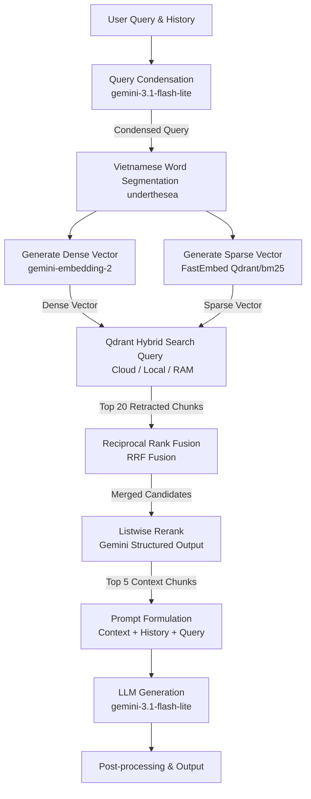

<p align="center">
  
</p>

<!-- <h1 align="center">Legal RAG</h1> -->

<p align="center">
  <a href="https://github.com/VictorNguyenLPN/Legal-RAG/stargazers">
    
  </a>
  <a href="https://github.com/VictorNguyenLPN/Legal-RAG/network/members">
    
  </a>
  <a href="https://github.com/VictorNguyenLPN/Legal-RAG/issues">
    
  </a>
</p>

<p align="center">
  <strong>Legal Document Question-Answering System (RAG) using Hybrid Search & Gemini</strong>
</p>

<p align="center">
  <a href="README_EN.md">English 🌐</a> | <a href="README.md">Tiếng Việt 🇻🇳</a> | <a href="README_ZH.md">简体中文 🇨🇳</a>
</p>

---

>[!NOTE] Current Version: v3.0.0 (13/08/2026)

The Legal Document Question-Answering System (Legal RAG) is built entirely in Python, utilizing Hybrid Search (Dense & Sparse) on top of **Qdrant**, Vietnamese word segmentation using **underthesea**, **Listwise Reranking** using Gemini, and generating precise answers with Google Gemini 3.1 Flash.

## Key Features

- **Hybrid Search:**
  - **Dense search:** Semantic search using `gemini-embedding-2` + `cosine similarity`.
  - **Sparse search:** Native Qdrant sparse index using `FastEmbed` (`Qdrant/bm25`).

- **Vietnamese Tokenization:** Integrated `underthesea` for Vietnamese word segmentation before sparse indexing, maximizing search accuracy for legal texts.

- **Listwise Reranking:** Leverages the Gemini API with structured JSON output schema to rerank candidate documents from RRF fusion, selecting the top 5 most relevant context chunks.

- **Cloud-Native Vector DB:** Switched to **Qdrant** supporting 3 run modes:
  - **Qdrant Cloud:** Persistent remote storage (recommended for Production).
  - **Qdrant Local Persistent:** Local disk storage under `data/db/qdrant` to avoid re-embedding and save Gemini API tokens on server restarts.
  - **Qdrant In-Memory:** Ephemeral RAM storage (when `QDRANT_USE_MEMORY=true` is set).

- **LLM**: Google Gemini (`gemini-3.1-flash-lite` / `gemini-2.5-flash`).

- **Conversation History Management:** Persistent storage of multi-session chats in browser LocalStorage. Allows users to create new sessions, toggle old chats, rename titles inline on the sidebar, and delete specific conversations with deletion confirmations or clear all history.

- **Intuitive UI:** Sleek frontend built with `React` + `Vite` + `TypeScript`.

---

## User Interface

### Main Dashboard (No Data Ingested)


### Active Query and Results


### Answers and Citations


## System Architecture



## Folder Structure

```text
Law-RAG/
├── backend/
│   └── app/
│       ├── api/
│       │   └── routes.py         # API endpoints definitions
│       ├── services/
│       │   ├── gemini_service.py # Gemini API clients (Embedding, Generation, Reranking)
│       │   └── rag_service.py    # Main pipeline and coordination
│       ├── retrieval/
│       │   ├── dense.py          # Dense similarity search via Qdrant
│       │   ├── sparse.py         # Sparse search via Qdrant
│       │   └── fusion.py         # Reciprocal Rank Fusion (RRF) implementation
│       ├── database/
│       │   └── vector_db.py      # Qdrant database client wrappers (Cloud/Local)
│       ├── models/
│       │   └── schema.py         # Pydantic models for request validation
│       ├── config.py             # System configurations and hyperparameters
│       └── main.py               # Main uvicorn FastAPI entrypoint
├── frontend/
│   └── src/
│       ├── App.tsx               # Main React Application
│       ├── components/           # Sub-components (Sidebar, Header, etc.)
│       └── index.css             # Main styling stylesheet
├── data/
│   ├── input/                    # Raw JSON corpus input directory
│   └── db/
│       └── qdrant/               # Local Qdrant DB persistent storage directory
├── requirements.txt              # Backend dependencies
└── README.md                     # Vietnamese guide
```

---

## Installation & Running Guide

### 1. Environment Setup

Make sure you have **Python 3.10+** installed. Initialize a virtual environment and install the dependencies:

```bash
# Create virtual environment
python3 -m venv .venv

# Activate virtual environment
source .venv/bin/activate

# Install required dependencies
pip install -r requirements.txt
```

### 2. API Key Configuration

The system requires a Google Gemini API Key. Provide the key using environment variables:

```bash
export GEMINI_API_KEY="AIzaSyYourGeminiApiKeyHere..."
```

Alternatively, create a `.env` file at the root of the project containing `GEMINI_API_KEY=AIzaSy...`.

### 3. Run Backend

```bash
PYTHONPATH=. .venv/bin/uvicorn backend.app.main:app --host 0.0.0.0 --port 8000 --reload
```
> Swagger API docs will be available at: http://localhost:8000/docs

### 4. Run Frontend

```bash
cd frontend && npm run dev
```
> The frontend UI will start and open automatically at: http://localhost:5173/

### 5. Input Data Format & Ingestion

To ingest your own legal documents, prepare a `.json` file containing a list of chunks.

#### Input JSON Schema:

The JSON file must be a JSON array of objects, with each object structured as follows:

```json
[
  {
    "chunk_id": "law_7eef1c6f9712c9a77af24be877851ca1_a1",
    "node_type": "article",
    "metadata": {
      "document_id": "7eef1c6f9712c9a77af24be877851ca1",
      "document_type": "Bộ luật",
      "document_title": "Bộ luật Hình sự số 15/1999/QH10",
      "doc_identity": "15/1999/QH10",
      "major_names": [
        "Tư pháp"
      ],
      "field_names": [
        "Chương XIV"
      ],
      "issue_date": "1999-12-21",
      "effect_date": "2000-07-01",
      "effect_status_name": "Hết hiệu lực toàn bộ",
      "expire_date": "2018-01-01",
      "organ_names": [
        "Quốc hội"
      ],
      "signer_title_names": [
        "Chủ tịch Quốc hội"
      ],
      "signer_names": [
        "Nông Đức Mạnh"
      ],
      "vbpl_url": "https://vbpl.vn/van-ban/chi-tiet/bo-luat-hinh-su-so-15-1999-qh10--6157",
      "source_guid": null,
      "scraped_date": "2026-07-01T20:04:58.071402+07:00",
      "part_number": null,
      "part_title": null,
      "chapter_number": "I",
      "chapter_title": "ĐIỀU KHOẢN CƠ BẢN",
      "section_number": null,
      "section_title": null,
      "article_number": 1,
      "article_title": "Nhiệm vụ của Bộ luật hình sự",
      "clause_number": null,
      "clause_title": "Bộ luật hình sự có nhiệm vụ...",
      "point": null,
      "hierarchy_path": [
        "7eef1c6f9712c9a77af24be877851ca1",
        "Chương I",
        "Điều 1"
      ]
    },
    "text": "Nhiệm vụ của Bộ luật hình sự\nBộ luật hình sự có nhiệm vụ bảo vệ..."
  }
]
```

#### Metadata Field Descriptions:
* `text` (String - Required): The text content of the document chunk to be indexed.
* `metadata` (Object - Required): Supporting details for sources and citations:
  * `document_title` (String - Required): Legal document name (e.g., Criminal Code, Civil Code).
  * `hierarchy_path` (Array of Strings - Optional): Section hierarchy path (e.g., `["Chapter I", "Article 1"]`).
  * `article_title` (String - Optional): Article title (e.g., `Mission of Criminal Code`).
  * `article_number` (Integer/String - Optional): Article number (e.g., `1`).
  * `clause_number` (Integer/String - Optional): Clause index number (e.g., `2`).
  * `point` (String - Optional): Point identifier (e.g., `a`, `b`).

#### How to Ingest Data:
1. Open the UI at [http://localhost:5173/](http://localhost:5173/).
2. Locate the **"Nhập Tài Liệu Pháp Lý"** (Ingest Legal Documents) section on the sidebar.
3. Click the upload area and select your prepared JSON file.
4. Once validated, click **"Lập chỉ mục tệp này"** (Index this file) to start vector embedding generation and sparse index generation.

---

## Version History

- v1.0.0 (29/07/2026): Initial MVP version with a small demo corpus.

- v1.1.0 (29/07/2026): Ingested Criminal Code corpus, improved citations display UI, and added React Markdown rendering.

- v2.0.0 (30/07/2026): Configured fallback triggers for queries containing unsupported contexts, refined layout spacing, corrected conversational prompts, and uploaded UI screenshots.

- v2.1.0 (30/07/2026): Updated demo corpus references.

- v2.2.0 (30/07/2026): Implemented startup checks to automatically initialize missing database collections from local `corpus.json` files.

- v2.3.0 (03/08/2026): Switched backend database driver to ChromaDB (supports Persistent disk storage and Server connection modes), added system connection indicators to sidebar, and resolved thread blocking during data ingestion.

- v2.3.1 (03/08/2026): Minor layout adjustments.

- v2.3.2 (03/08/2026): Optimized database collection size calculations (using metadata counts instead of retrieving all chunks on search queries), migrated React inline styles to stylesheet classes, and removed redundant/commented code snippets. Added latency and token usage for each response.  

- v2.4.0 (04/08/2026): Implemented persistent multi-session conversation history using browser LocalStorage. Supported creating new sessions, switching conversations, inline renaming, and deletion actions with confirmation alerts.

- v2.5.0 (13/08/2026): Upgraded RAG architecture to Cloud-native using Qdrant (supporting Cloud/Local Persistent/In-memory modes). Integrated Qdrant-native sparse index via FastEmbed, underthesea tokenizer for Vietnamese word segmentation, and listwise reranking layer via Gemini API.

- v2.6.0 (August 14, 2026): 
  - Synchronize the colorized log system with Uvicorn. Live Timer integration measures the execution time of each RAG phase on the interface and displays performance metadata information (latency, token usage) for each answer. 
  - Deeply optimize Backend Cloud performance and reliability. 
  - Optimized the `/status` endpoint to run record counting directly (`len(vector_db)`) instead of downloading entire chunks, improving speed from seconds to less than 5ms, completely resolving the phenomenon of UI flickering and connection loss. 
  - Set up Self-Healing Ingestion at startup: Automatically detect and refill cleanly if the collection on Qdrant Cloud is missing data. 
  - Fix `read operation timed out` error when uploading data to Qdrant Cloud by increasing network timeout to 120s and adjusting batch size automatically. 
  - Convert all content generation and Reranking functions of Gemini to Chat objects that are compatible with the Automatic Function Calling (AFC) mechanism of the latest Google GenAI SDK, completely removing warnings in the log. 
  - UI improvements: Add a yellow "Connecting..." intermediate status when loading the page, integrate a visual response time display right next to the "Answering..." question generation status label.

- v2.6.1(August 15, 2026): Clean source code, remove unused components