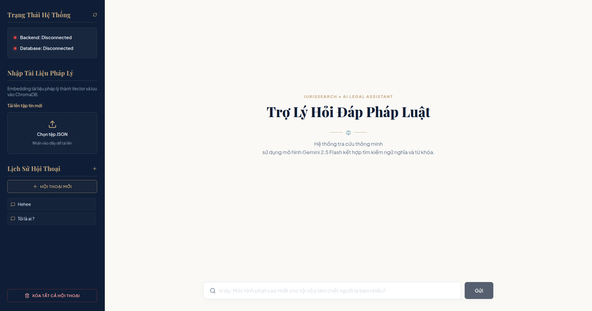
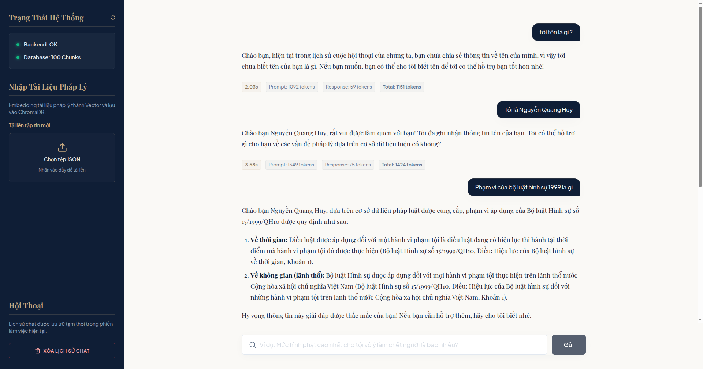
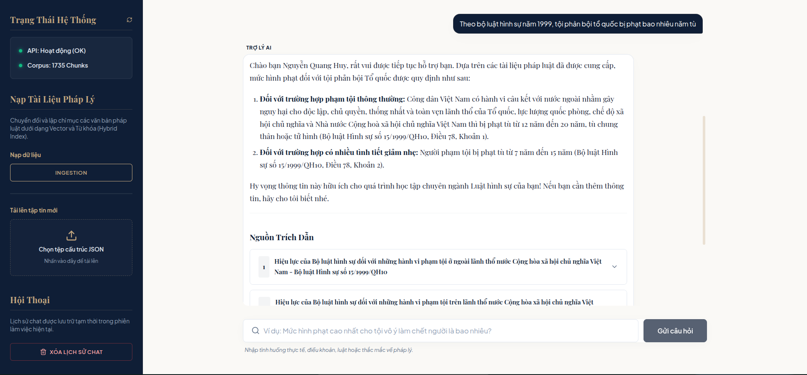

<p align="center">
  
  <h1 align="center">Legal RAG</h1>
</p>

<!-- <h1 align="center">Legal RAG</h1> -->

<p align="center">
  <a href="https://github.com/VictorNguyenLPN/Legal-RAG/stargazers">
    
  </a>
  <a href="https://github.com/VictorNguyenLPN/Legal-RAG/network/members">
    
  </a>
  <a href="https://github.com/VictorNguyenLPN/Legal-RAG/issues">
    
  </a>
</p>

<p align="center">
  <strong>Legal Document Question-Answering System (RAG) using Hybrid Search & Gemini</strong>
</p>

---

>[!NOTE] Current Version: v2.3.2 (03/08/2026)

The Legal Document Question-Answering System is built entirely in Python, using BM25 combined with Google Gemini Embedding for search retrieval, and Google Gemini for answer generation.

## Key Features

- **Hybrid Search:**
  - **Dense search:** `gemini-embedding-2` + `cosine similarity`.
  - **Sparse search:** `BM25` (optimized for Vietnamese).

- **Reciprocal Rank Fusion (RRF):** Merges and optimizes rankings from Dense and Sparse searches.

- **Vector Database:** Powered by ChromaDB (supports local Persistent directory storage or HTTP connection to Docker/remote server).

- **LLM**: Google Gemini (`gemini-3.1-flash-lite` / `gemini-2.5-flash`).

- **Intuitive UI:** Sleek frontend built with `React` + `Vite` + `TypeScript`.

---

## User Interface

### Main Dashboard (No Data Ingested)


### Active Query and Results


### Answers and Citations


## Folder Structure

```text
Law-RAG/
├── backend/
│   └── app/
│       ├── api/
│       │   └── routes.py         # API endpoints definitions
│       ├── services/
│       │   ├── gemini_service.py # Gemini API clients integration
│       │   └── rag_service.py    # Main pipeline and coordination
│       ├── retrieval/
│       │   ├── dense.py          # Dense similarity search via ChromaDB
│       │   ├── sparse.py         # Sparse BM25 keyword search
│       │   └── fusion.py         # Reciprocal Rank Fusion (RRF) implementation
│       ├── database/
│       │   └── vector_db.py      # ChromaDB database client wrappers
│       ├── models/
│       │   └── schema.py         # Pydantic models for request validation
│       ├── config.py             # System configurations and hyperparameters
│       └── main.py               # Main uvicorn FastAPI entrypoint
├── frontend/
│   └── src/
│       ├── App.tsx               # Main React Application
│       ├── components/           # Sub-components (Sidebar, Header, etc.)
│       └── index.css             # Main styling stylesheet
├── data/
│   ├── input/                    # Raw JSON corpus input directory
│   └── chroma/                   # Local Chroma DB persistent storage directory
├── requirements.txt              # Backend dependencies
└── README.md                     # Vietnamese guide
```

---

## Installation & Running Guide

### 1. Environment Setup

Make sure you have **Python 3.10+** installed. Initialize a virtual environment and install the dependencies:

```bash
# Create virtual environment
python3 -m venv .venv

# Activate virtual environment
source .venv/bin/activate

# Install required dependencies
pip install -r requirements.txt
```

### 2. API Key Configuration

The system requires a Google Gemini API Key. Provide the key using environment variables:

```bash
export GEMINI_API_KEY="AIzaSyYourGeminiApiKeyHere..."
```

Alternatively, create a `.env` file at the root of the project containing `GEMINI_API_KEY=AIzaSy...`.

### 3. Run Backend

```bash
PYTHONPATH=. .venv/bin/uvicorn backend.app.main:app --host 0.0.0.0 --port 8000 --reload
```
> Swagger API docs will be available at: http://localhost:8000/docs

### 4. Run Frontend

```bash
cd frontend && npm run dev
```
> The frontend UI will start and open automatically at: http://localhost:5173/

### 5. Input Data Format & Ingestion

To ingest your own legal documents, prepare a `.json` file containing a list of chunks.

#### Input JSON Schema:

The JSON file must be a JSON array of objects, with each object structured as follows:

```json
[
  {
    "chunk_id": "law_7eef1c6f9712c9a77af24be877851ca1_a1",
    "node_type": "article",
    "metadata": {
      "document_id": "7eef1c6f9712c9a77af24be877851ca1",
      "document_type": "Bộ luật",
      "document_title": "Bộ luật Hình sự số 15/1999/QH10",
      "doc_identity": "15/1999/QH10",
      "major_names": [
        "Tư pháp"
      ],
      "field_names": [
        "Chương XIV"
      ],
      "issue_date": "1999-12-21",
      "effect_date": "2000-07-01",
      "effect_status_name": "Hết hiệu lực toàn bộ",
      "expire_date": "2018-01-01",
      "organ_names": [
        "Quốc hội"
      ],
      "signer_title_names": [
        "Chủ tịch Quốc hội"
      ],
      "signer_names": [
        "Nông Đức Mạnh"
      ],
      "vbpl_url": "https://vbpl.vn/van-ban/chi-tiet/bo-luat-hinh-su-so-15-1999-qh10--6157",
      "source_guid": null,
      "scraped_date": "2026-07-01T20:04:58.071402+07:00",
      "part_number": null,
      "part_title": null,
      "chapter_number": "I",
      "chapter_title": "ĐIỀU KHOẢN CƠ BẢN",
      "section_number": null,
      "section_title": null,
      "article_number": 1,
      "article_title": "Nhiệm vụ của Bộ luật hình sự",
      "clause_number": null,
      "clause_title": "Bộ luật hình sự có nhiệm vụ...",
      "point": null,
      "hierarchy_path": [
        "7eef1c6f9712c9a77af24be877851ca1",
        "Chương I",
        "Điều 1"
      ]
    },
    "text": "Nhiệm vụ của Bộ luật hình sự\nBộ luật hình sự có nhiệm vụ bảo vệ..."
  }
]
```

#### Metadata Field Descriptions:
* `text` (String - Required): The text content of the document chunk to be indexed.
* `metadata` (Object - Required): Supporting details for sources and citations:
  * `document_title` (String - Required): Legal document name (e.g., Criminal Code, Civil Code).
  * `hierarchy_path` (Array of Strings - Optional): Section hierarchy path (e.g., `["Chapter I", "Article 1"]`).
  * `article_title` (String - Optional): Article title (e.g., `Mission of Criminal Code`).
  * `article_number` (Integer/String - Optional): Article number (e.g., `1`).
  * `clause_number` (Integer/String - Optional): Clause index number (e.g., `2`).
  * `point` (String - Optional): Point identifier (e.g., `a`, `b`).

#### How to Ingest Data:
1. Open the UI at [http://localhost:5173/](http://localhost:5173/).
2. Locate the **"Nhập Tài Liệu Pháp Lý"** (Ingest Legal Documents) section on the sidebar.
3. Click the upload area and select your prepared JSON file.
4. Once validated, click **"Lập chỉ mục tệp này"** (Index this file) to start vector embedding generation and sparse index generation.

---

## Version History

- v1.0.0 (29/07/2026): Initial MVP version with a small demo corpus.

- v1.1.0 (29/07/2026): Ingested Criminal Code corpus, improved citations display UI, and added React Markdown rendering.

- v2.0.0 (30/07/2026): Configured fallback triggers for queries containing unsupported contexts, refined layout spacing, corrected conversational prompts, and uploaded UI screenshots.

- v2.1.0 (30/07/2026): Updated demo corpus references.

- v2.2.0 (30/07/2026): Implemented startup checks to automatically initialize missing database collections from local `corpus.json` files.

- v2.3.0 (03/08/2026): Switched backend database driver to ChromaDB (supports Persistent disk storage and Server connection modes), added system connection indicators to sidebar, and resolved thread blocking during data ingestion.

- v2.3.1 (03/08/2026): Minor layout adjustments.

- v2.3.2 (03/08/2026): Optimized database collection size calculations (using metadata counts instead of retrieving all chunks on search queries), migrated React inline styles to stylesheet classes, and removed redundant/commented code snippets. Added latency and token usage for each response.  
