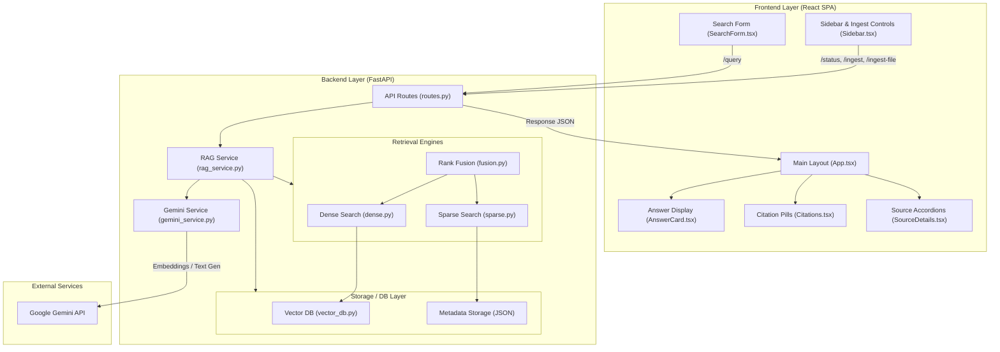
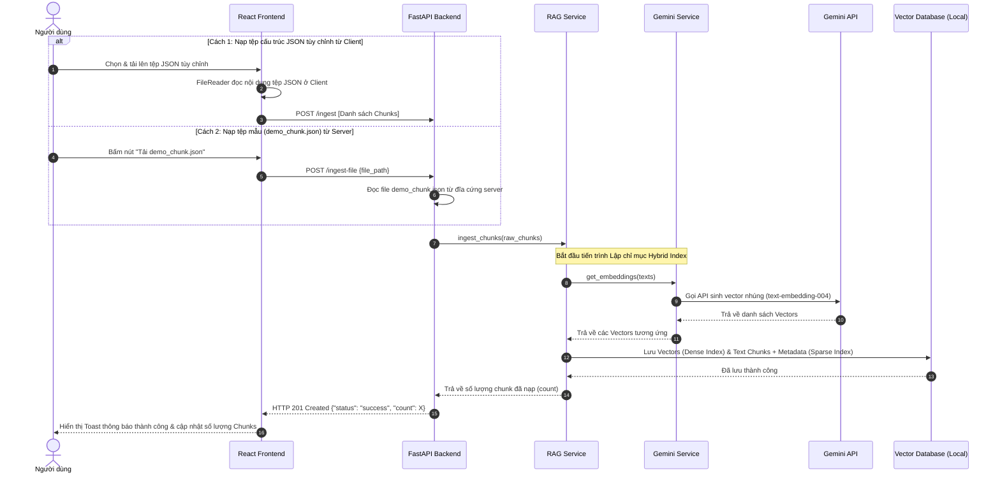
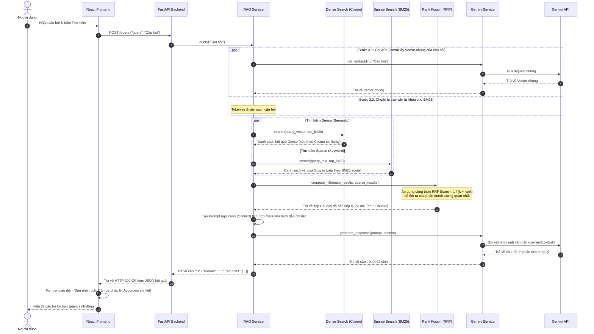

# Kiến Trúc Hệ Thống Law-RAG

Tài liệu này mô tả chi tiết kiến trúc hệ thống của Law-RAG, bao gồm luồng nạp dữ liệu (Ingestion Pipeline), luồng truy vấn hỏi đáp (RAG Pipeline) và sự tương tác giữa các thành phần React Frontend và FastAPI Backend.

---

## 1. Sơ đồ các Thành phần Hệ thống (System Components)

Sơ đồ dưới đây thể hiện sự tương tác tổng quan giữa lớp Giao diện người dùng (React SPA), cổng API (FastAPI) và các thành phần xử lý logic, nghiệp vụ tìm kiếm kết hợp (Hybrid Search) và tích hợp mô hình ngôn ngữ Google Gemini.

---

## 2. Luồng Nạp và Lập Chỉ Mục Dữ Liệu (Ingestion Pipeline)

Luồng này mô tả cách tài liệu pháp luật (định dạng JSON chứa các phân mảnh văn bản kèm siêu dữ liệu metadata) được lập chỉ mục Hybrid Index (bao gồm chỉ mục Dense Vector và chỉ mục từ khóa Sparse BM25).

---

## 3. Luồng Hỏi Đáp kết hợp và Trích dẫn (RAG Pipeline)

Luồng này mô tả cách hệ thống tiếp nhận câu hỏi của người dùng, thực hiện tìm kiếm song song Dense Search và Sparse Search, dung hợp kết quả bằng thuật toán RRF, tạo prompt và gọi mô hình Gemini 2.5 Flash để sinh câu trả lời kèm trích dẫn chính xác.

